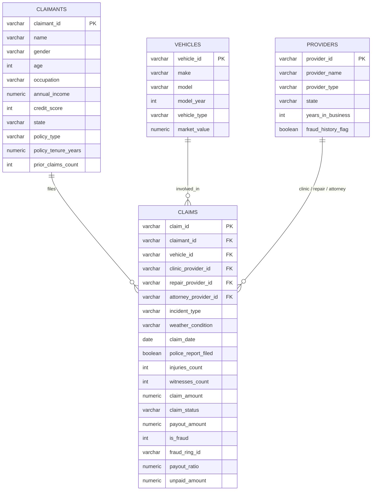

# 🛡️ Insurance Fraud Intelligence & Risk Analysis

[](https://github.com)
[](https://github.com)
[](https://github.com)

---

## 📌 Executive Summary

Insurance fraud presents a critical financial leak for auto and property insurers, leading to bloated operational expenses, inflated payout ratios, and higher premium burdens for legitimate policyholders. 

This repository presents an **end-to-end Business Intelligence & Fraud Intelligence solution** designed to detect suspicious claim patterns, uncover organized fraud rings, monitor high-risk third-party providers (clinics, repair shops, attorneys), and compute automated **Fraud Risk Scores** for incoming claims.

Through rigorous data preprocessing in Python, relational modeling in SQL, automated validation procedures, and multi-tier business analysis, this project translates raw insurance claims data into actionable business strategies and executive dashboards.

---

## 📊 Business Analyst Key Findings & Insights

### 1. Macro Fraud Performance Overview
* **Total Portfolio Volume:** **8,924 claims** evaluated, accounting for **~$36.48M** in total claim value.
* **Confirmed Fraud Rate:** **5.87%** of overall claims (**524 fraudulent claims**).
* **Financial Loss Exposure:** Fraudulent claims account for **~$2.14M** in potential fraud exposure.
* **Average Claim Value:** **$4,087.77** per claim across the portfolio (ranging from $100.41 up to $21,878.27). Average payout ratio stands at **88.13%**.

### 2. Organized Fraud Ring Dynamics
* **100% Correlation with Organized Rings:** All 524 identified fraudulent claims are linked directly to **20 active Fraud Rings** (`RING000` through `RING019`).
* **Top Concentrated Rings:** `RING001` (45 claims), `RING010` (42 claims), and `RING018` (42 claims) represent the largest clusters of coordinated fraudulent activities.

### 3. Key Fraud Risk Drivers & Behavioral Indicators
* **Provider Risk:** Third-party entities (attorneys, repair shops, clinics) with a prior fraud flag have a significantly elevated fraud rate. Claims associated with blacklisted providers demonstrate the strongest positive correlation with fraud.
* **Absence of Police Reports:** Claims submitted without an official police report exhibit higher fraud frequency compared to reported accidents (**+2 Risk Score Weight**).
* **Witness Availability:** Incidents with **0 witnesses** have a starkly higher probability of fraud (**+2 Risk Score Weight**).
* **Claim Size Threshold:** Claims exceeding the **$4,008.06** average/median threshold contain higher fraudulent severity (**+1 Risk Score Weight**).
* **Repeat Claimant Profile:** Policyholders with **>2 prior claims** present heightened risk for recurrent fraud attempts (**+1 Risk Score Weight**).

---

## 🎯 Automated Fraud Risk Scoring Framework

To enable automated triage and real-time claim prioritization, a **9-Point Weighted Risk Scoring Algorithm** was engineered (implemented in `03_Business_analysis.sql`):

$$\text{Fraud Risk Score} = W_{\text{provider}} + W_{\text{police\_report}} + W_{\text{witness}} + W_{\text{claim\_amount}} + W_{\text{repeat\_claimant}}$$

| Risk Factor / Indicator | Criteria | Risk Points Weight | Business Justification |
| :--- | :--- | :---: | :--- |
| **Provider History** | Repair, Clinic, or Attorney has `fraud_history_flag = TRUE` | **+3** | Strongest indicator of systematic / provider-colluded fraud |
| **Police Report** | `police_report_filed = FALSE` | **+2** | Unverified incident details allow fabricated claims |
| **Witness Count** | `witnesses_count = 0` | **+2** | Lack of neutral verification |
| **Claim Threshold** | `claim_amount > $4,008.06` | **+1** | High severity financial exposure |
| **Repeat Claimant** | `previous_claim_count > 2` | **+1** | Pattern of frequent claims history |
| **TOTAL MAXIMUM SCORE** | | **9 Points** | |

### Triage & Action Matrix

```
┌─────────────────┬─────────────┬────────────────────────────────────────────────────────┐
│ Fraud Risk Score│ Risk Tier   │ Operational Business Action                            │
├─────────────────┼─────────────┼────────────────────────────────────────────────────────┤
│ Score 5 – 9     │ 🔴 HIGH     │ Immediate payout freeze & mandatory SIU referral      │
│ Score 3 – 4     │ 🟡 MEDIUM   │ Document verification & secondary desk audit required  │
│ Score 0 – 2     │ 🟢 LOW      │ Fast-track automated claim processing & settlement     │
└─────────────────┴─────────────┴────────────────────────────────────────────────────────┘
```

---

## 🗂️ Project Repository Structure

```
Insurance_fraud_analysis/
│
├── 📁 Raw Data/                         # Primary uncleaned source CSV files
│   ├── claimants.csv                    # 4,000 policyholder demographic & policy records
│   ├── claims.csv                       # 8,924 raw insurance claims records
│   ├── providers.csv                    # 250 healthcare, repair, & legal provider profiles
│   └── vehicles.csv                     # 4,000 insured vehicle specifications
│
├── 📁 Cleaned Data/                     # Sanitized, formatted datasets ready for ETL & SQL
│   ├── claimants_cleaned.csv
│   ├── claims_cleaned.csv               # Features calculated columns (payout_ratio, dates, etc.)
│   ├── providers_cleaned.csv
│   └── vehicles_cleaned.csv
│
├── 📁 Python/                           # Data Science & Exploratory Data Analysis notebooks
│   ├── Cleaning_data.ipynb              # Automated cleaning script, missing value handling & formatting
│   └── EDA.ipynb                        # Statistical distributions, correlations, & fraud visual profiling
│
├── 📁 Dashboard/                        # Executive visual intelligence reports
│   ├── 01 Insurance Fraud Intelligence.jpg           # Portfolio metrics & fraud macro view
│   ├── 02 Provider And Claimant Risk Analysis.jpg    # Deep-dive on high-risk providers & claimants
│   └── 03 Fraud Risk Score.jpg                       # Risk score distribution & triage performance
│
├── 📜 01_Create_table.sql               # PostgreSQL DDL table schema definitions
├── 📜 02_Data_validation.sql            # ETL audit suite (Referential integrity, duplicate checks)
└── 📜 03_Business_analysis.sql          # SQL queries for business questions & Risk Scoring engine
```

---

## 🗄️ Database Architecture & Relational Schema

The relational database architecture spans **4 primary entities** designed for high analytical throughput:



---

## 📈 Executive Dashboards

The project incorporates three executive-level visual dashboards located in the [`Dashboard/`](Dashboard/) directory to provide strategic, operational, and tactical intelligence:

### 1. Insurance Fraud Intelligence
*Strategic macro view displaying total claim exposure ($36.48M), confirmed fraud rate (5.87%), claims status breakdowns, and temporal monthly trend analysis.*


---

### 2. Provider And Claimant Risk Analysis
*Operational risk analysis spotlighting high-risk legal/medical/repair providers, state-level fraud geographic distribution, and claimant policy tenure patterns.*


---

### 3. Fraud Risk Score Analysis
*Tactical triage dashboard visualizing risk score distributions (0 to 9), ring network clusters (`RING000`-`RING019`), and high-priority claim queueing for Special Investigation Units (SIU).*


---

## 🛠️ Step-by-Step Setup & Execution Guide

### Prerequisites
* **Python 3.10+** (with `pandas`, `numpy`, `matplotlib`, `jupyter`)
* **PostgreSQL 14+** (or compatible SQL Database)

### 1. Data Cleaning & Feature Engineering (Python)
Execute the Jupyter Notebooks in `Python/` to re-generate cleaned datasets from raw sources:
```bash
jupyter notebook Python/Cleaning_data.ipynb
jupyter notebook Python/EDA.ipynb
```

### 2. Database Creation & Schema DDL (SQL)
Run [`01_Create_table.sql`](01_Create_table.sql) in your PostgreSQL database environment to establish tables:
```sql
\i '01_Create_table.sql'
```

Import sanitized CSV files from [`Cleaned Data/`](Cleaned Data/) into their respective SQL tables:
* `claimants_cleaned.csv` $\rightarrow$ `public.claimants`
* `vehicles_cleaned.csv` $\rightarrow$ `public.vehicles`
* `providers_cleaned.csv` $\rightarrow$ `public.providers`
* `claims_cleaned.csv` $\rightarrow$ `public.claims`

### 3. Data Integrity & Validation Audit (SQL)
Run [`02_Data_validation.sql`](02_Data_validation.sql) to audit data quality, verify zero missing foreign keys across 5 relational constraints, and confirm non-negative financial values:
```sql
\i '02_Data_validation.sql'
```

### 4. Business Analysis & Risk Scoring (SQL)
Run [`03_Business_analysis.sql`](03_Business_analysis.sql) to run executive queries and generate fraud risk scores for all active claims:
```sql
\i '03_Business_analysis.sql'
```

---

## 💡 Strategic Business Recommendations

1. **Automate SIU Escalation for Risk Scores $\ge 5$:** Implement real-time score triggers in core claims processing platforms to automatically hold payouts and route high-scoring claims to the Special Investigation Unit.
2. **Provider Blacklisting & Network Audits:** Establish mandatory annual audits for repair providers, clinics, and law firms flag-marked in existing fraud rings (`RING001`, `RING010`, `RING018`).
3. **Mandatory Police Verification for High-Value Claims:** Enforce strict documentation requirements (mandatory police report upload) for any claim exceeding the **$4,000** threshold without neutral witnesses.
4. **Fraud Ring Cross-Referencing:** Utilize shared bank account hashes and VIN cross-checking to detect multi-claimant fraud ring expansion in real time.

---
